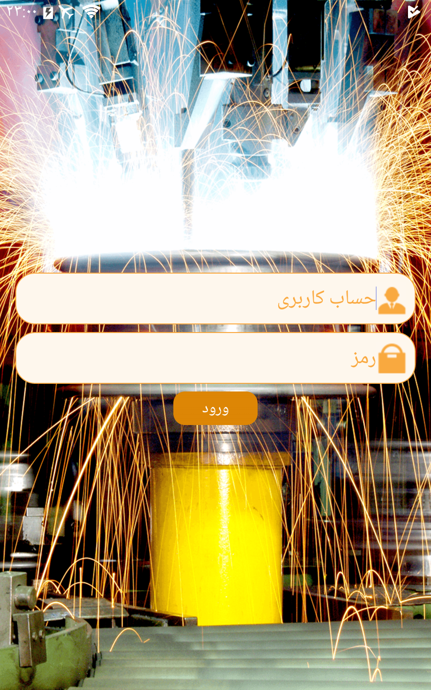
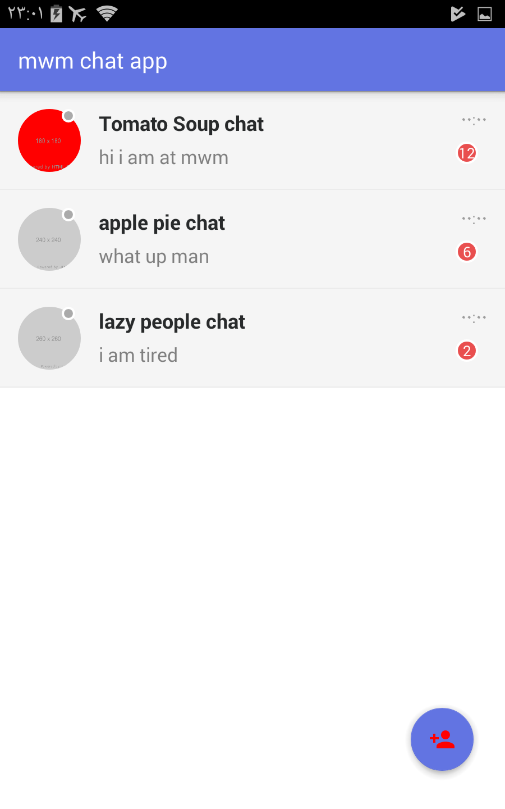
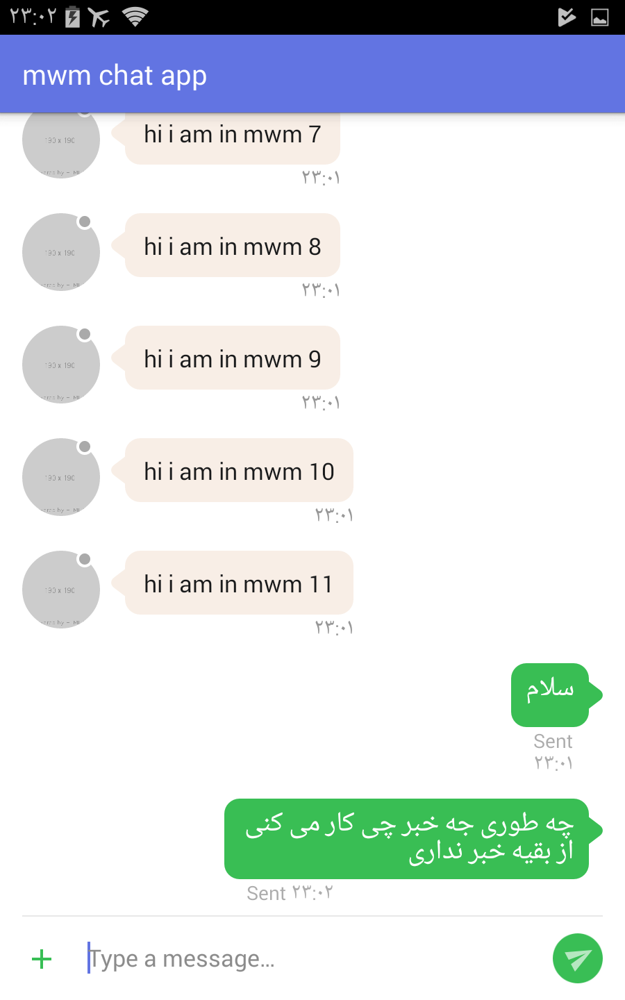
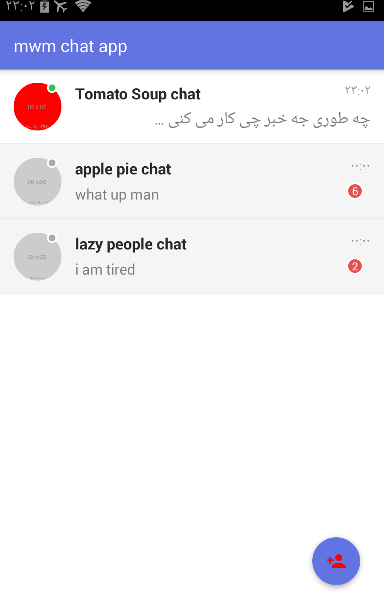

# Corporate Messenger

این برنامه تهیه شده تا نمونه ی برای یک برنامه پیام رسان برای موسسات و شرکت ها باشد
  <p align="center" >
        
        
        
        
    </p>

This application is developed as a sample for a messaging application for institutions and companies.
  <p align="center" >
        
        
        
        
    </p>

### Features

* صفحه ورود کاربر
* نمونه اماده برای  استفاده و ظاهر گرافیکی مناسب
* امکان ارسال پیام ها (عکس،فایل،فیلم) با ظاهر پیش فرض یا دلخواه 
* صفحات ویرایش پذیر شامل تغییر پس زمینه،ارم ها،عکس و فونت  
* لیست چت ها شامل چت های گروهی نمایش اخرین پیام،تعداد پیام های خوانده نشده و وضعیت کاربر
* لیست پیام ها شامل عکس فرستنده و گیرنده و تاریخ ارسال  
* امکان ثبت عکس پروفایل 
*  امکان ویرایش یا حذف پیام ها 
* برجسته سازی ادرس ایمیل یا شماره تلفن یا آدرس سایت
* امکان ویرایش ساده مدل برحسب نیاز
* محل اماده برای تایپ پیام همراه با دکمه افزودن پیوست
* انمیشن ها روان و زیبا
* شامل نمونه ارتباط با سرور

* User login page
* Ready-made sample for use and suitable graphical appearance
* Ability to send messages (photos, files, videos) with default or custom appearance
* Editable pages including changing background, logos, images, and fonts
* Chat list including group chats, displaying the last message, number of unread messages, and user status
* Message list including sender and recipient photos and send date
* Ability to register a profile picture
* Ability to edit or delete messages
* Highlighting email addresses, phone numbers, or website addresses
* Ability to easily edit the model as needed
* Ready-made place for typing messages with an attachment button
* Smooth and beautiful animations
* Includes sample server communication

**[Continue translating the rest of the document, following the same format]**

### **Explanation of the Approach:**

- **Language indicators:** The comments `` and `` clearly demarcate the language of each section.
- **Preserved formatting:** The original Markdown syntax for headings, images, lists, and paragraphs remains unchanged.
- **Bilingual content:** Both the Persian and English translations are placed side-by-side for easy comparison and reference.

**Note:**

* **Accuracy of Persian translation:** Ensure that the Persian translation is accurate and reflects the nuances of the original text. Consider using a combination of machine translation and human review for the best results.
* **Technical terms:** For technical terms, consult with a subject matter expert to ensure the translations are precise and consistent.
* **Cultural nuances:** Be aware of cultural differences and nuances that might affect the translation. For example, certain phrases or idioms might have different connotations in different languages.

By following this approach, you can create a well-structured, bilingual .md file that is easy to read, understand, and maintain.
```
Copyright (C) 2018

Licensed under the Apache License, Version 2.0 (the "License");
you may not use this file except in compliance with the License.
You may obtain a copy of the License at

https://github.com/nimamoradi/mwm_chat/blob/master/LICENSE

Unless required by applicable law or agreed to in writing, software
distributed under the License is distributed on an "AS IS" BASIS,
WITHOUT WARRANTIES OR CONDITIONS OF ANY KIND, either express or implied.
See the License for the specific language governing permissions and
limitations under the License.

```
